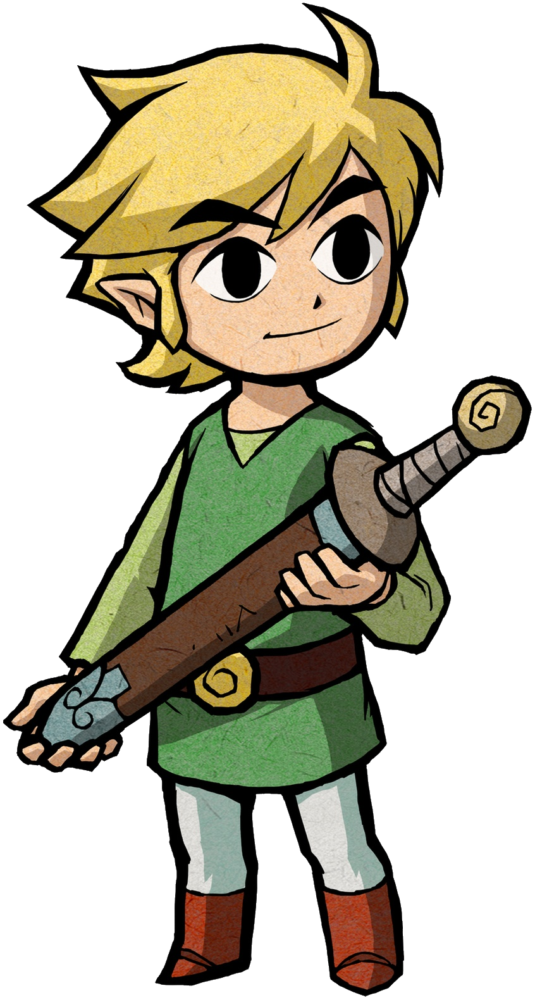

# Portfólio Simples - de Gabriel Noberto

Aqui ficam exercícios simples de cursos online que compõem meus estudos para que eu possa mostrar a amigos, à comunidade dev, e recrutadores.

## HTML5 e CSS3 - Curso Em Vídeo

* [Código dos exercícios](https://github.com/iamdevNoel/html-css)